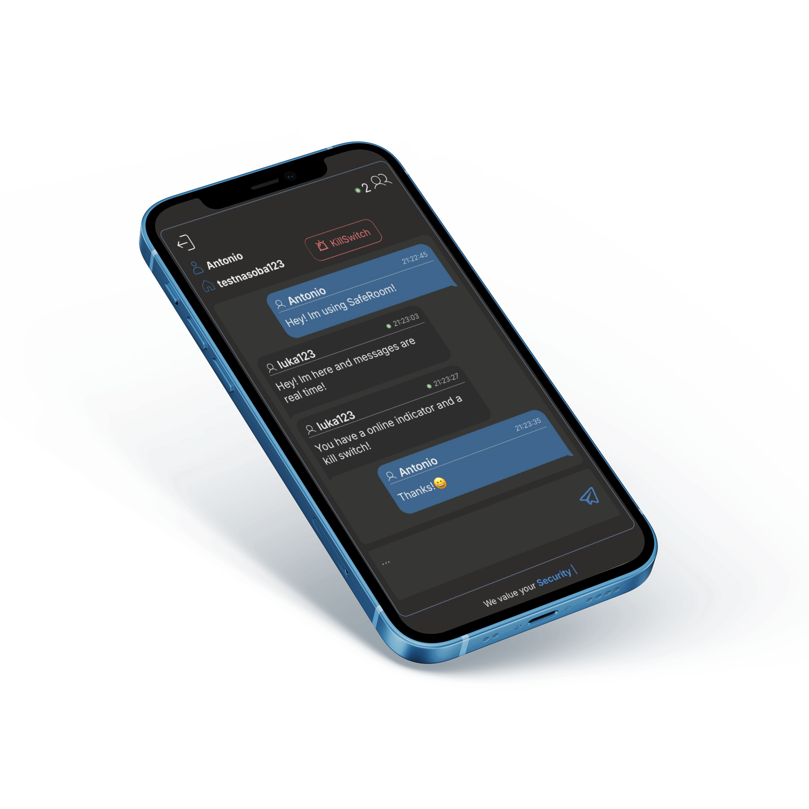

#  **SafeRoom - Real-Time Chat Room App**

A real-time chat room application built from scratch, including both backend and frontend components.

<p align="center">

  
  
  
  
  
</p>

---

## **Tech Stack**

- **Frontend**: React
- **Backend**: Express.js, Socket.io
- **Data Store**: Redis
- **Remote State Management**: TanStack Query + Axios
- **Styling**: Styled-Components

---

## **Features**

1. **Chat Room Management**

   - Create chat rooms with custom names.
   - Protect chat rooms with passwords for secure access.

2. **Real-Time Messaging**

   - Instant chat powered by Socket.io for seamless communication.

3. **Encrypted Communication**

   - Basic message encryption using `crypto.subtle` and `AES-CBC` for added security.

4. **Self-Destructing Rooms**

   - Chat rooms automatically self-destruct after a configurable time period.

5. **Kill Switch**

   - Each room member has access to a Kill Switch to permanently delete all messages for all users.

6. **Online Users List**

   - See real-time indications of online users and a list of participants in each room.

---

## **Screenshots**

<p align="center">
  
  
  
</p>

---

## **How to use**

1. **Clone the Repository**

   ```bash
   git clone <repoUrl>
   ```

2. **Configure Redis**

   The application uses a Redis instance managed by Docker. Ensure you have [Docker Desktop](https://www.docker.com/products/docker-desktop/) installed.Then run:

   ```bash
   docker compose up
   ```

   > docker-desktop required on windows

3. **Generate SSL certificates**

   Generate SSL certificates for both the backend and frontend using tools like `openssl` or `makecert`. Save them with the following filenames:

   - `cert.pem` (SSL certificate)
   - `key.pem` (Private key)

   Place these files in the root directory of both the backend and frontend folders..

   > Encryption requires HTTPS!
   >
   > > If using openssl, ensure to manually trust both the backend and frontend.

4. **Configure .env and install dependencies:**

   - To configure your environment, create a .env file in the root directory of both backend and frontend and set the required variables like the `.env.example` files.

   - Install Dependencies via:

     ```bash
     npm i
     ```

5. **Start backend**

   Navigate to the backend directory and start the server:

   ```bash
   node server.js
   ```

   > Basic API Docs available via Swagger on /backend/api-docs

6. **Start frontend server**

   Navigate to the frontend directory and start the development server:

   ```bash
   npm run dev
   ```

---

## **License**

This project is licensed under the [MIT License](./LICENSE).

---

## **Contributing**

If you’d like to contribute to the development of SafeRoom, feel free to fork the repository and submit pull requests. We welcome suggestions and improvements!

---
